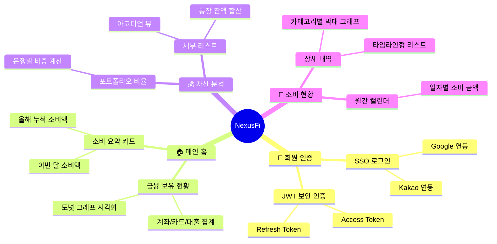

#  NexusFi (넥서스파이)
> **"마이데이터 기술을 활용한 지능형 가계부 및 자산 관리 통합 대시보드 웹 애플리케이션"**

---

## 📌 목차
1. [프로젝트 개요](#-프로젝트-개요)
2. [기획 배경 및 목적](#-기획-배경-및-목적)
3. [핵심 서비스 가치](#-핵심-서비스-가치)
4. [프로젝트 기능 명세 구조도](#-프로젝트-기능-명세-구조도)
5. [상세 화면 및 기능 기획](#-상세-화면-및-기능-기획)
6. [데이터 및 시스템 전략](#-데이터-및-시스템-전략)
7. [서비스 로드맵](#-서비스-로드맵)

---

## 📋 프로젝트 개요
NexusFi는 현대인의 복잡한 금융 생활을 하나로 연결하는 **마이데이터 기반의 자산 관리 솔루션**입니다. 여러 금융 기관에 흩어져 있는 자산 정보를 실시간으로 통합하고, 이를 직관적인 대시보드 형태로 제공하여 사용자가 능동적으로 자신의 경제 상황을 관리할 수 있도록 돕는 웹 기반 애플리케이션입니다. 

이 프로젝트는 백엔드 개발자와 프론트엔드 개발자 2명이 각자의 전문성을 바탕으로 실무적인 문제 해결 과정을 기록하고 성장하기 위해 시작되었습니다.

## 🔍 기획 배경 및 목적
### 1. 금융 데이터의 파편화
금융 자산이 여러 플랫폼에 흩어져 있어 발생하는 통합 관리의 어려움을 해결하고자 합니다.
### 2. 가계부 작성의 한계
자동화된 데이터 수집과 분석을 통해 사용자의 입력 공수를 최소화하고 데이터의 정확성을 높입니다.
### 3. 데이터 기반의 의사결정 필요성
축적된 소비 데이터를 바탕으로 미래 자산을 예측하고 건전한 소비 습관을 형성하는 '데이터 드리븐' 금융 환경을 구축합니다.

---

## 📊 프로젝트 기능 명세 구조도

---

## 💡 상세 화면 및 기능 기획

### 1. 🔐 회원 인증 (Authentication)
*   **SSO 기반 소셜 로그인**: Google 및 Kakao 계정 연동을 통해 별도의 가입 절차 없이 간편하고 안전한 접근을 지원합니다.
*   **확장성 있는 인증 설계**: 향후 다양한 소셜 플랫폼 확장이 가능하도록 OAuth 2.0 표준을 준수하며, JWT를 이용해 세션을 효율적으로 관리합니다.

### 2. 🏠 메인 홈: 금융 현황 간편 조회 (Dashboard)
*   **카테고리별 보유 현황**:
    *   **[UI]** 도넛 그래프를 통해 계좌, 카드, 대출의 구성비를 시각화합니다.
    *   **[Data]** 사용자 보유 자산 데이터를 유형별로 그룹화하여 총 건수를 실시간 집계합니다.
*   **기간별 총 소비 요약**:
    *   **[UI]** 카드 UI 형태의 직관적인 요약 정보를 제공합니다.
    *   **[Data]** 이번 달 및 올해의 지출 합계를 계산하며, 전월 대비 증감률을 통해 소비 흐름을 분석합니다.

### 3. 💰 자산 분석 (Asset Analysis)
*   **자산 포트폴리오 비율**:
    *   **[UI]** 전체 자산 중 각 은행이나 투자처가 차지하는 비율을 도넛 그래프로 표시합니다.
*   **은행별 자산 세부 리스트**:
    *   **[UI]** 아코디언 방식의 리스트 뷰를 사용하여 각 금융기관별 세부 잔액 정보를 깔끔하게 제공합니다.
    *   **[Data]** 여러 계좌의 잔액을 금융사별로 합산하여 표시합니다.

### 4. 📅 소비 현황 조회 (Consumption Diary)
*   **월간 소비 캘린더**:
    *   **[UI]** 달력 뷰에 날짜별 총 지출액을 매핑하여 한 달의 흐름을 파악합니다.
*   **일자별 소비 상세 (Drill-down)**:
    *   **카테고리별 소비 분포**: 막대 그래프를 통해 해당 날짜의 주요 소비 분야(식비, 교통 등)를 분석합니다.
    *   **건별 소비 내역**: 타임라인 스타일의 리스트로 결제 시간, 가맹점, 금액, 태그 정보를 상세히 노출합니다.

---

## ⚙️ 데이터 및 시스템 전략 (Backend Insight)
*   **대용량 데이터 집계**: Spring Batch를 활용하여 대량의 거래 내역을 정기적으로 집계하고, 성능 최적화를 위해 통계 데이터를 미리 생성합니다.
*   **보안 가이드라인 준수**: 금융 데이터를 다루는 만큼 암호화 알고리즘을 적용하고 민감 정보 노출을 최소화합니다.

## 🗺️ 서비스 로드맵
*   **Phase 1**: 마이데이터 기반 통합 조회 및 기초 대시보드 구축.
*   **Phase 2**: 소비 패턴 분석 정교화 및 목표 지출 설정 기능 추가.
*   **Phase 3**: AI 기반 미래 자산 예측 및 개인화된 금융 솔루션 제언.

---
각자의 분야에서 깊이 있는 고민을 나누며, 더 나은 서비스를 만들기 위해 함께 노력하고 있습니다.
